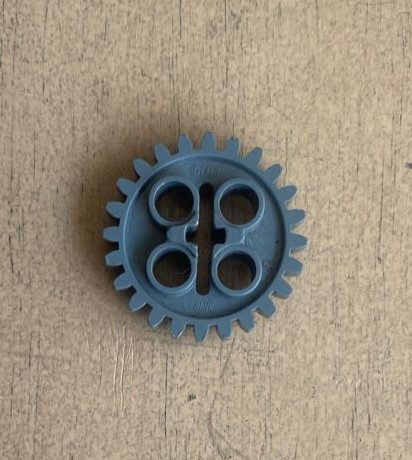
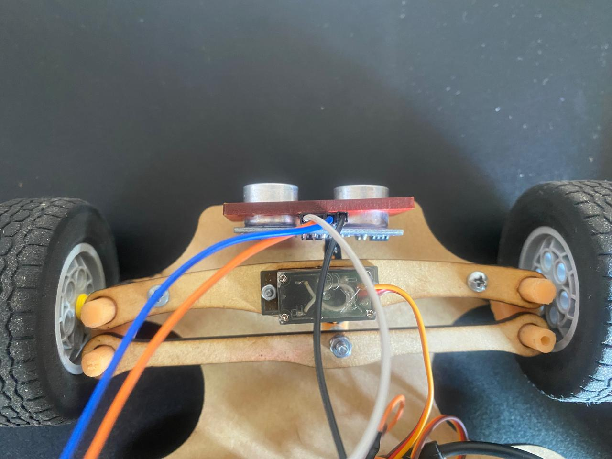
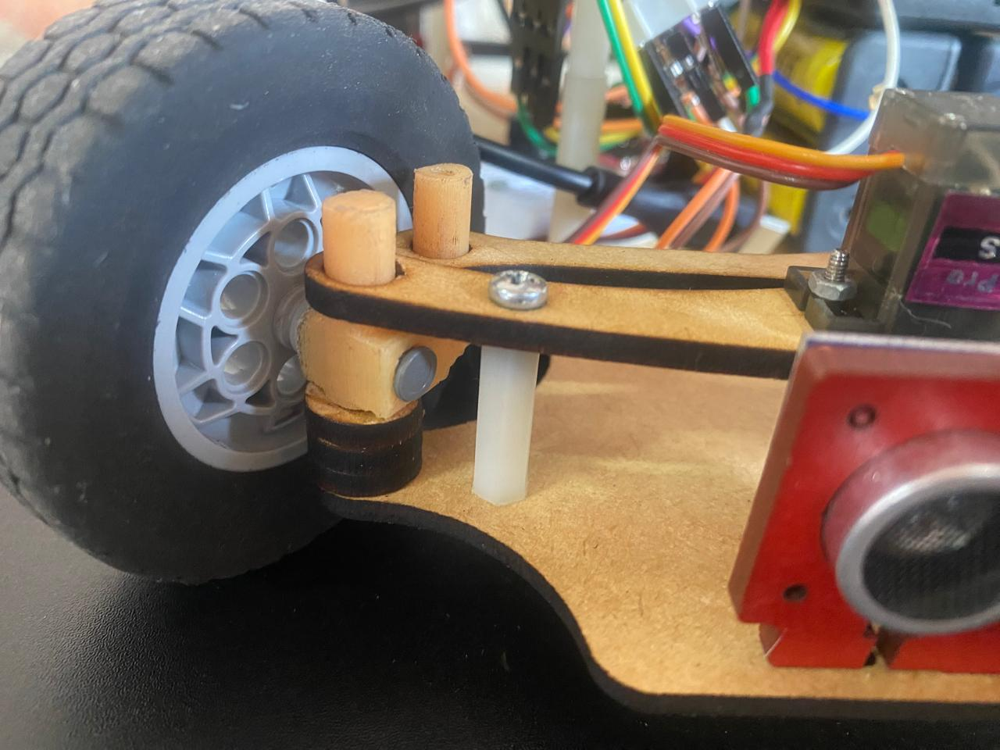
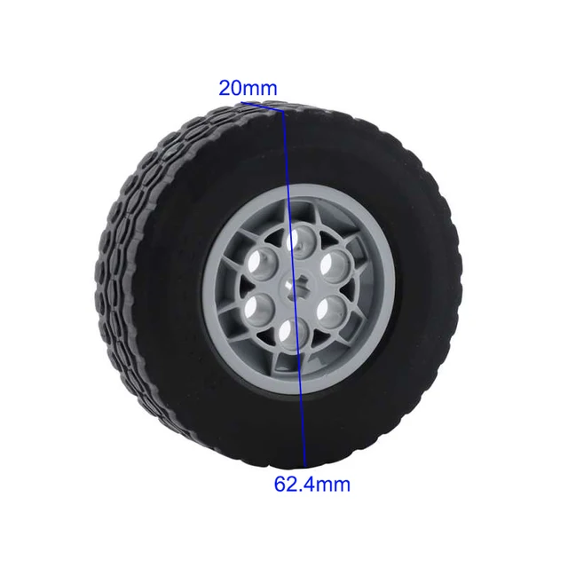

Modelos 
===
En este apartado se encuentran los diseños y modelos 3d de las partes mecanicas que componen el robot junto con la explicación y justificación de su uso, para información acerca de las piezas y su relación con los componentes electricos revisar por favor carpeta [schemes](/schemes/README.md).

Partes Mecánicas
===
Un dato que consideramos recalcar es que la mayoria de las partes mecanicas las mandamos a hacer en corte laser, y otra pequeña seccion de piezas, en su mayoria del sistema de direccíon, las mandamos a imprimir en 3D.

## Chasis del Vehiculo
El vehiculo consta de su chasis y y otros 2 pisos, cada uno de los pisos cuenta con diferentes componentes del robot:
- **Chasis** Gesiton de movimiento del robot
  - Sistema de direccion, Motor de movimiemto, Driver para motor y un Mini Protoboard.
  - [Vista de Chasis](/models/S25_Chasis_Rev12.STL).
- **Piso 1** Controladores del Robot
  - Arduino Mega, Raspberry Pi y camara
  - [Vista de Piso 1](/models/S25_BS_Rev6.STL).
- **Piso 2** Componentes Electricos
  - Mini Protoboard con HMI y Girosensor.
  - [Vista de Piso 2](/models/S25_Piso3_Rev1.STL).
 
Como se puede notar, en los nombres de archivo de todos los modelos se menciona la revisión de cada parte mecanica, por ejemplo el chasis lleva 12 revisiones, esto por cada uno de los cambios que hemos necesitado durante la temporada. Es la parte que más ha cambiado, en otras secciones del repositorio hemos mencionado que nuestro robot era muy distinto durante la etapa regional a como se ve actualmente para la etapa nacional y ese el principal motivo por el cual la pieza ha cambiado tanto, a partir de la Rev8, es cuando comienza a verse como es actualmente.

**Actualización 14/09/2025**

1. Modificación del Chasis y Sistema de Potencia

**Motivación:** Durante las pruebas de rendimiento en el desafío de obstáculos, se observó un consumo energético excesivo del módulo Raspberry Pi, el cual provocaba una descarga acelerada de las baterías (∼0.08V por ciclo completo). Este fenómeno comprometía la autonomía operativa del robot para cumplir con múltiples intentos o rondas de competencia.

**Solución Implementada:** Para resolver este cuello de botella energético, se implementó una expansión del sistema de potencia mediante la integración de un cuarto portapilas, conectado en paralelo con los existentes. Esta configuración:

  - **Incrementa la capacidad total** (Ah) del banco de baterías.

  - **Mantiene el voltaje nominal** de operación de todos los componentes.

  - **Proporciona mayor autonomía** al distribuir la demanda de corriente entre más fuentes.

**Cambios Adicionales:** Como parte de la reconfiguración del chasis, se reoptimizó la ubicación del regulador de voltaje y la protoboard para mejorar la accesibilidad, la estética y la gestión de cables.

- [S25_Chasis_Rev14](/models/S25_Chasis_Rev14.STL).

Para mantener los portabaterias en su posición diseñamos otra pieza (hay 2 en el robot) que es capaz de sostener 2 portabaterias a la vez, aqui se puede apreciar la pieza:

- [SB_DrakoR_Rev2](/models/SB_DrakoR_Rev2.STL).

## Gestión de Movilidad
**Soporte para Motor**

Esta parte mecanica al estar relacionada a un componente electrico, su explicacíon se encuentra en [schemes](/schemes/README.md)

**Soporte para Ejes del Motor**

El eje de salida de nuestro motor se acopla a ejes (axles) LEGO que están conectados directamente a las llantas. Durante las primeras pruebas, notamos que estos ejes se pandeaban, lo que generaba una fuerza adicional no deseada en el eje Z del motor y provocaba un comportamiento inconsistente en cada prueba.

Como solución, diseñamos e implementamos un soporte personalizado para estos ejes. Una vez instalados, los ejes se mantienen perfectamente alineados en un ángulo de **180°**, eliminando el pandeo y garantizando un comportamiento uniforme y predecible.
- [Soporte para ejes](/models/S25_Soporte_Eje_Motor_Rev1.STL).

**Engrane Spur 24D**

Inicialmente, utilizamos un engrane Spur LEGO de 24 dientes al que taladramos el centro para que calzara en el eje principal del motor. Esto nos permitió validar el comportamiento del sistema diferencial.

Sin embargo, esta solución provisional presentaba dos problemas críticos: el desgaste por uso deformaba rápidamente el agujero y generaba un **backlash** (juego) considerable. Para resolverlo, diseñamos nuestro propio engrane manteniendo las dimensiones estándar de LEGO pero con el diámetro interior exacto de nuestro eje, asegurando un ajuste perfecto y eliminando el juego.

- Engrane Viejo:

- [Engrane propuesto por el equipo](/models/S25_Spur_24D_Rev3.STL)

**Dirección** 

Nuestro sistema de dirección funciona mediante un mecanismo de **enlaces** conectados a las **manguetas**. En el centro de uno de estos enlaces, una pieza personalizada se conecta directamente a un servomotor **MG90S**, que nos permite posicionar la dirección con precisión en los ángulos específicos que requiere nuestro algoritmo de navegación.

Los enlaces fueron fabricados en **MDF** por su rigidez y bajo peso, mientras que las manguetas y conectores se imprimieron en 3D para lograr geometrías complejas y un peso reducido.

- **Piezas del sistema de dirección:**
  - [Conector del Servo a Viga 1](/models/S25_Conexion_Servo-enlace_Rev2.STL).
  - [Viga 1](/models/S25_Enlace_Direccion_Rev5.STL).
  - [Viga 2](/models/S25_Soporte_Servo_Rev4.STL).
  - [Espaciadores](/models/S25_Rondana_Direccion_Rev1.STL).
  - [Manguetas](/models/S25_Mangueta_Rev1.STL).
 Este ultimo, fue impreso de 2 maneras, uno con el diseño original y otro espejeado.

**Llantas**

Utilizamos llantas LEGO del modelo **62.4mm** debido a nuestra experiencia positiva con ellas en competencias previas de Robomission. Confiamos en su excelente **agarre** y la **baja fricción** que generan, lo cual es crucial para la eficiencia energética y la tracción del robot.

## Gestion de Obstaculos

**Soporte para Cámara**

El sistema de visión se compone de varias partes personalizadas:

  - [Soporte para Poste](/models/S25_Soporte_Poste_Camara_Rev1.STL).
  - [Poste](/models/S25_Poste_Camara_Rev1.STL).
  - [Soporte para camara](/models/S25_Soporte_Camara_Rev1.STL).
  - [Union de 70 grados](/models/S25_Union_70_grados_Camara_Rev1.STL).

La **altura** y la **inclinación** de la cámara son críticas para nuestro algoritmo. La configuración debe permitir al robot detectar obstáculos dentro de un cuadrante específico de la pista.

- Una inclinación de **90°** (vertical) no permitía una detección temprana.

- Una inclinación inicial de **45°** apuntaba la cámara demasiado hacia el suelo, detectando los obstáculos demasiado tarde.

- Tras un proceso de **prueba y error**, determinamos que un ángulo de **70°** era el óptimo para nuestro caso de uso, ya que proporciona el campo de visión necesario para una detección oportuna y confiable.
  

***Actualización 07/09/2025***

Cambiamos el angulo del soporte para la camara a 63° y subimos la altura del soprte 1/8", anteriormente con las especificaciones que mencionabamos el robot tenia un margen de error muy bajo para posicionarce frente a los obstaculos y fallaba al momento de detectar la posicion y color de los obstaculos.

**Optimización del Ángulo y Altura de la Cámara**

Para mejorar la confiabilidad en la detección de la posición y el color de los obstáculos, ajustamos la configuración:

- **Ángulo de inclinación:** Cambiado de **70°** a **63°**.
  
[S25_Union63_grados_Poste-Soporte_CamaraRev2](/models/S25_Union63_grados_Poste-Soporte_CamaraRev2.STL).

- **Altura del soporte:** Aumentada en **1/8 de pulgada**.
  
[S25_Soporte_CamaraRev2.STL](/models/S25_Soporte_CamaraRev2.STL).

La configuración anterior, aunque funcional, dejaba un **margen de error muy bajo** para que el robot se posicionara correctamente frente a los obstáculos. Estos ajustes finos incrementaron significativamente la tasa de éxito de la detección y el posicionamiento.
