Electrical Diagrams
====

This section presents the electrical diagrams of all components along with a description of their operation. Furthermore, it breaks down the robot's hardware and its integration with the mechanical parts. All 3D models and designs mentioned here are available in the [models](/models) folder.

## General Vehicle Electrical Diagram: 

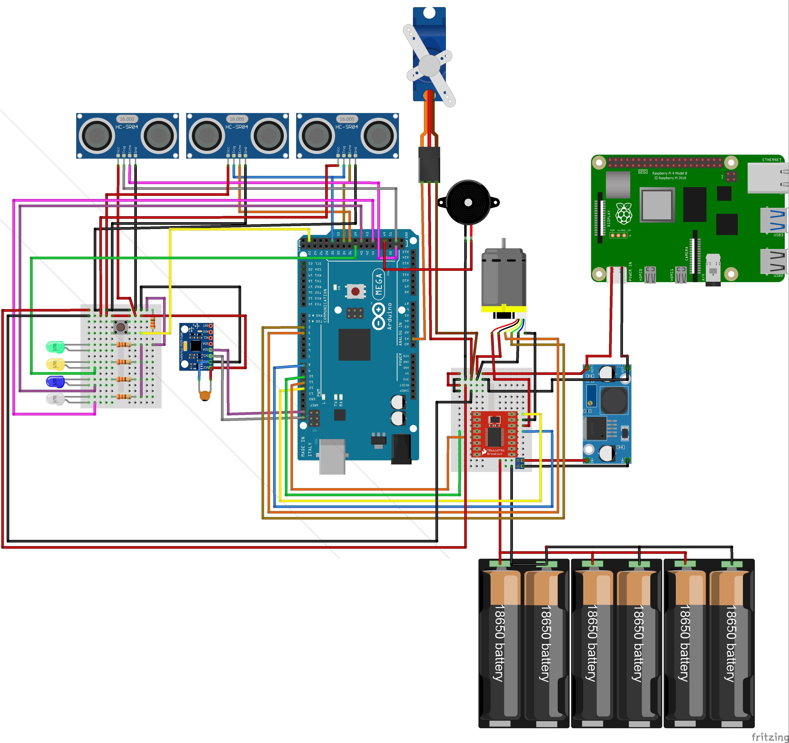

***Specifications:*** The **Arduino MEGA** board is powered directly through the serial communication port of the **Raspberry Pi 4** computer. The Raspberry Pi, in turn, is powered by our **LM2596** voltage regulator, set to **5.1V** and **3A**. We adjusted the regulator to 5.1V because when set exactly to 5V, the Raspberry Pi would often experience power supply issues.

## Electrical Diagrams for Each Component and Sensor:

***Clarification:*** The following diagrams show the signal connections for each sensor and electrical component. **Only* the **Power System** and **Motor with Motor Driver** diagrams include the power supply connections, as these are essential for replicating the robot. The other diagrams omit these connections to provide flexibility for other teams, but they can be referenced in the **General Electrical Diagram** shown above.

- **Ultrasonic Sensors**
  
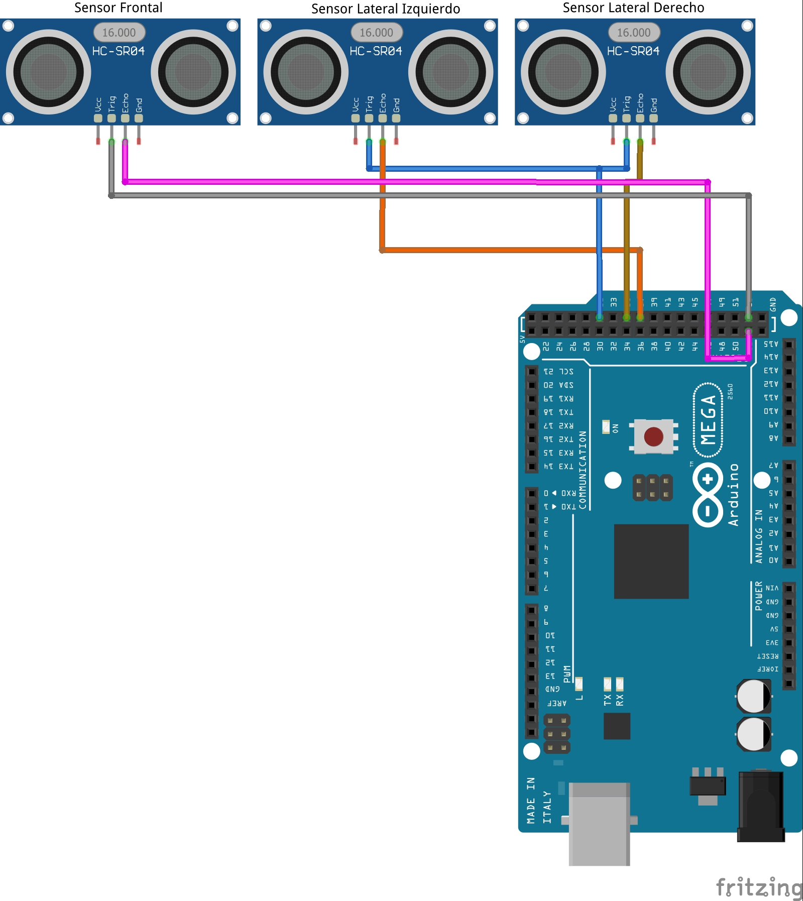

- **Accelerometer/Gyroscope**
  
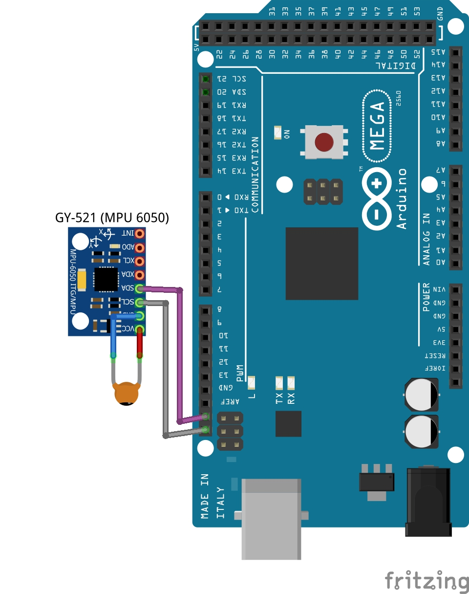

- **Servo Motor**
  
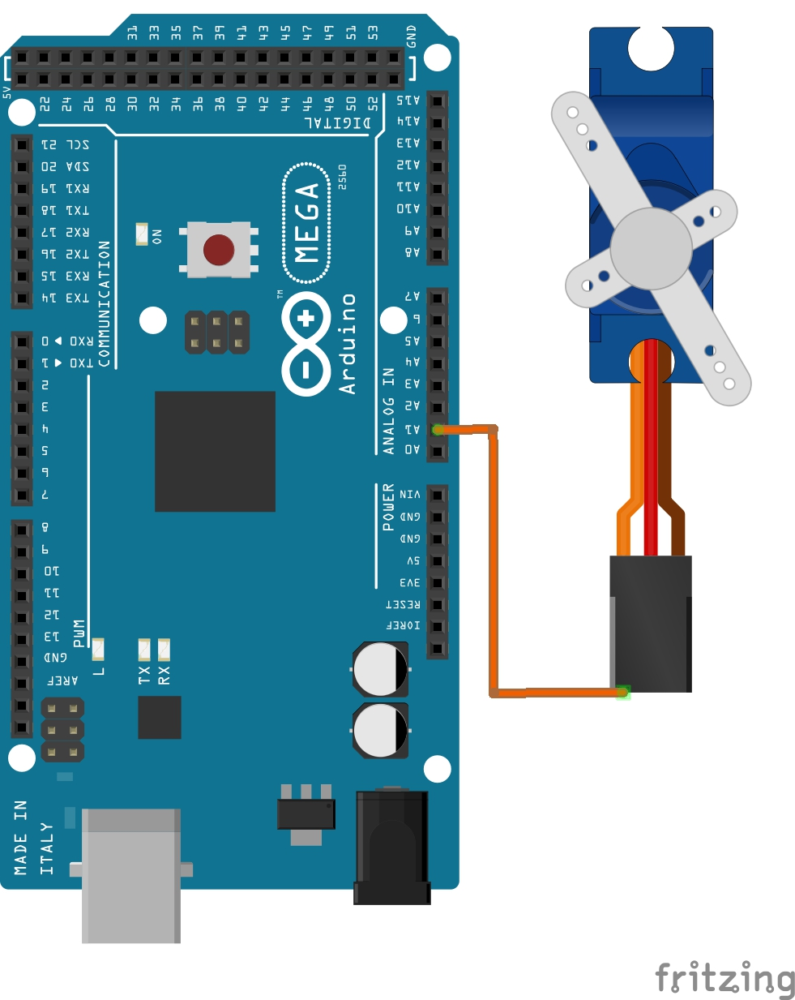

- **Human Machine Interface**
  
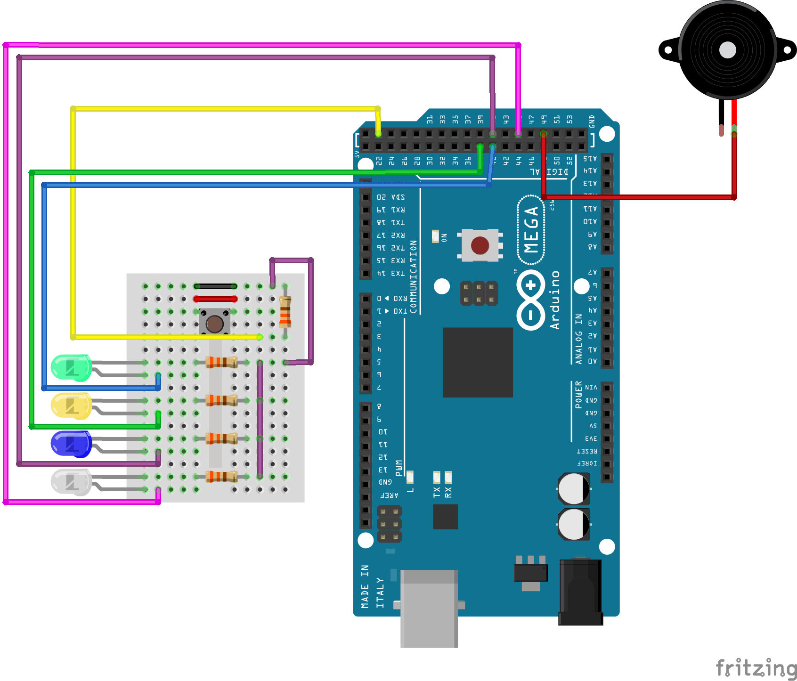

- **Motor 12v - Motor Driver**
  
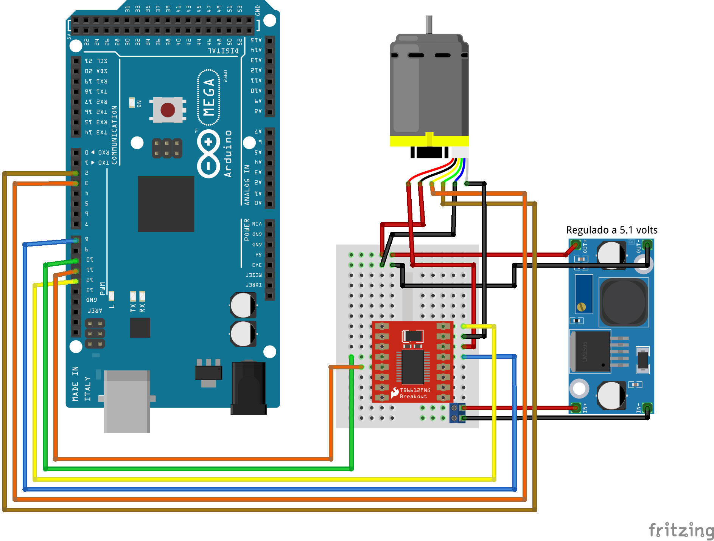

- **Power Stage and Raspberry Pi 4**
  
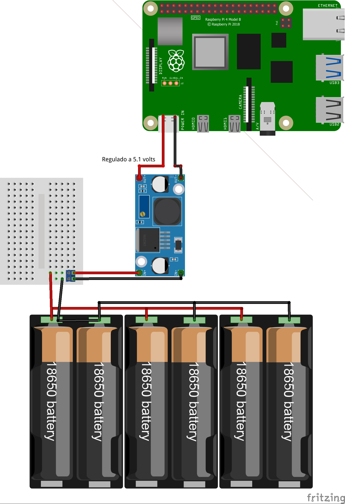

Mobility Management
===
## 12V DC Motor with Encoder
We selected this motor primarily for its **integrated encoder**. This sensor allows us to track the robot's position, which provides multiple benefits for our solution: calculating rotation count, measuring distance traveled, assisting in parallel parking, and, in general, all variables related to positioning.

Initially, we used a motor from an RC toy that included a differential. We used that motor during the regional stage in Mexicali. We decided to change it because its speed was too inconsistent, and the lack of an encoder made it very difficult to maintain consistent movements. We understand that it's impossible for a robot to repeat a routine exactly, but that component made it even more challenging. Switching to a motor with an encoder and a LEGO differential gives us much greater control over these variables. To achieve this, we designed a mount to couple the motor to the LEGO differential, which went through 3 revisions.

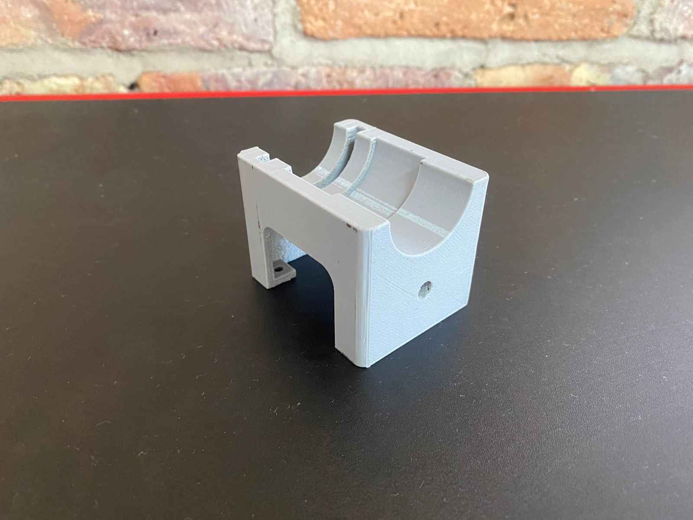

*This is what the first version looked like. It allowed for basic testing, but the motor was not secured to the mount, which caused disturbances and instability.*

-[Soporte para motor Rev3](/models/S25_Soporte_Motor_y_Transmision_Rev3.STL) 

*In the current revision, the motor is firmly secured to the mount, eliminating disturbances caused by movement.* We had a similar case with the gear that connects to the motor.

## Movement 
To make the robot move in a straight line, we use a gyro sensor with a PD controller. This allows the robot to maintain its heading. As mentioned before, it's impossible to be perfect, but with this system the deviation is minimal, never exceeding 2° from the initial point (considering 0° as the origin).

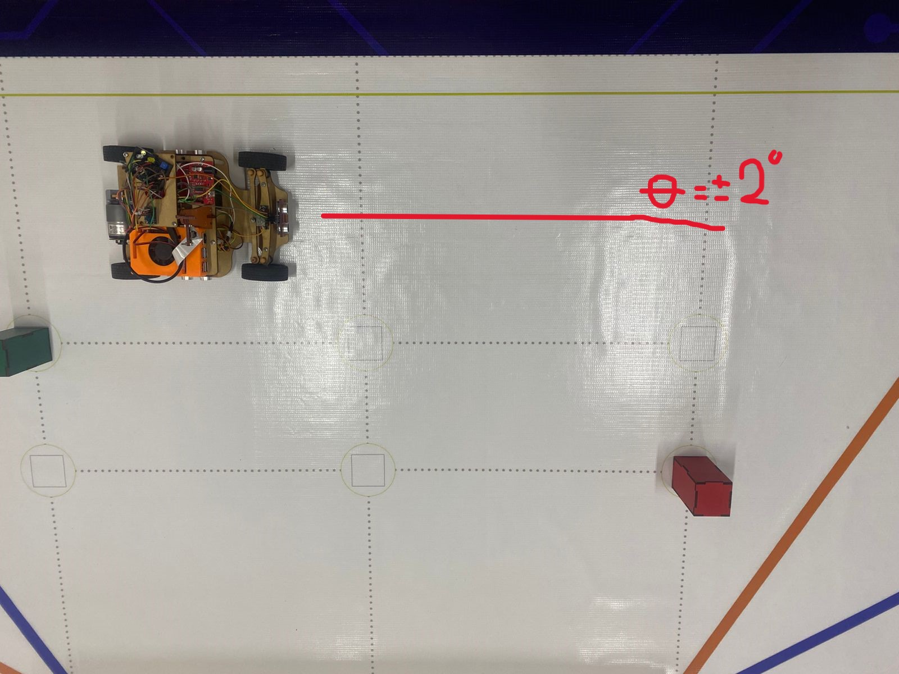

Similarly, we use the gyro sensor for the robot's turns. Upon reaching the desired point, the robot turns the wheels and moves forward until it detects the target angle. Once reached, it stops the motors and returns the steering to the neutral position.

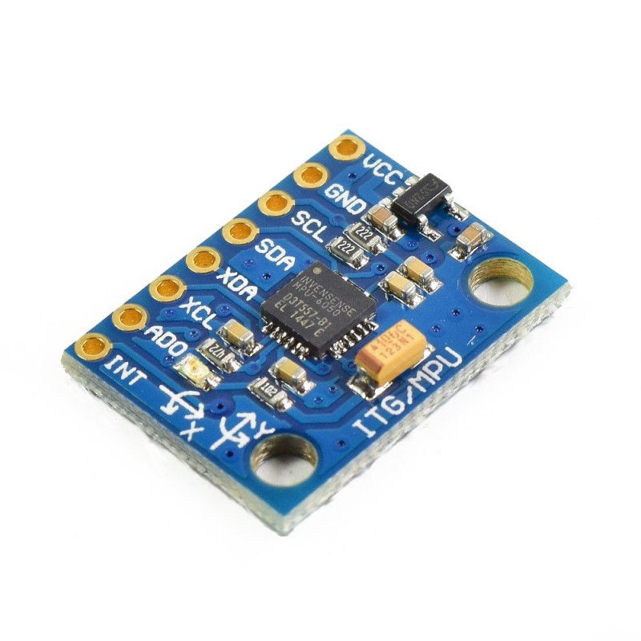

**Update 12/09/2025: Inertial Measurement Unit (IMU) Replacement**

**Reason:** The previous IMU (GY-521) exhibited intermittent reading failures, characterized by a lock-up or saturation of its output values. This behavior caused inaccuracies in determining the vehicle's orientation, affecting the reliability of our test runs.

**Action:** The unit was replaced with a **GY-9250** model (which integrates the MPU-9250 and BMP280 sensors), selected for its reported higher stability and reliability.

**Replication Note:** For the purpose of replicating the base system, the previous sensor model is functional. This update addresses a specific need for robustness and precision during continuous operation.

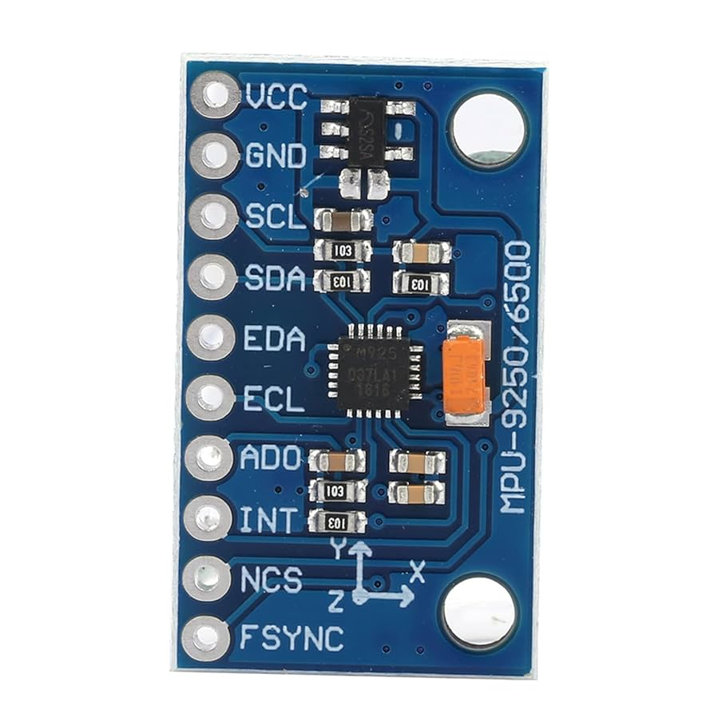

Power and Sensor Management
====

## Energy
The robot uses **six 3.7V 9900mAh (18650) batteries**. They are divided into **four battery holders connected in parallel** to manage current efficiently. The system's maximum voltage is **8.4V**.

To power our **Raspberry Pi 4 computer**, we use an **LM2596 voltage regulator set to 5.1V**. This allows the board to function correctly without needing to be plugged into a wall outlet. It's important to note that we initially conducted tests for obstacle management with the Pi connected to a wall outlet, which allowed us to validate our code's behavior. However, it was evident that we needed to solve this power issue for the robot to be fully autonomous.

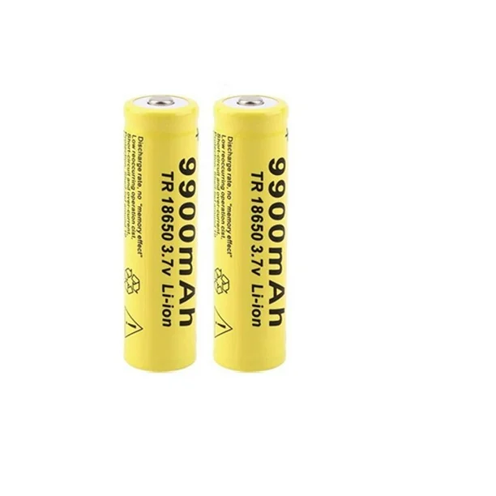

## Sensors
At the start of the season, our initial proposal was to use **VL53L0X laser sensors**. We thought they would be the best option due to their long range and precision, so our first chassis was designed for them. During testing, we realized their characteristics were problematic for us: the **conical field of view** caused the sensors to detect the floor, leading to many failures. Furthermore, using 3 of these sensors consumed an excessive amount of our microcontroller's memory (at that time, an Arduino UNO).

These issues led us to replace them with **HC-SR04 ultrasonic sensors**. We used these in the regional competition, and they remain in our current model. The change was straightforward thanks to our modular design; the mounts for the ultrasonic sensors we had designed for previous projects used the same mounting system as the laser sensor mounts on the chassis, making the transition quick and easy.

We have **3 ultrasonic sensors:** 1 at the front and 2 on the sides. The side sensors are primarily used to determine the turning direction. Once the robot leaves the first quadrant, there will always be one side with a barrier and one without. The sensor detecting the greater distance will dictate the turn direction (clockwise or counterclockwise).

The front sensor has multiple functions:

1. In the "Free Turn" challenge, it detects the distance to the wall before turning. Upon detecting 50 cm, the robot stops and proceeds to turn.

2. In the "Obstacles" challenge, it detects proximity to an obstacle. Upon detecting less than 15 cm, it stops and turns in the direction indicated by the color.

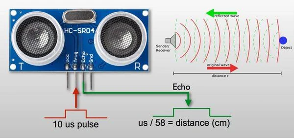

## HMI (Human-Machine Interface)
On the vehicle's third level, there is a mini protoboard (170 points) with **3 LEDs and a button**. A passive buzzer is also mounted on the chassis.

**Free Turn Challenge:** When the start button is pressed, an LED turns on and the buzzer plays a sound, indicating that the code is running.

**Obstacles Challenge:** Depending on the case detected by the camera, different LEDs light up to provide visual feedback, and the buzzer plays distinct sounds for each case.

**Note:** The buzzer also generates a sound whenever the ultrasonic sensors detect an object.

Obstacle Management
===
## Camera
For the obstacle challenge, we chose to use a **Raspberry Pi Camera rev.1.3.** This section only details how we mounted the camera on the vehicle and the models used. For information on the detection algorithm and the obstacle avoidance solution, please refer to the [src](/src) folder.

Before using the official Raspberry camera, we used the ***Night Vision Camera for Raspberry Pi - IR-CUT 5MP model.** As the name implies, it is a night vision camera. When testing it with OpenCV, the image had a red filter that prevented our color detection algorithm from working correctly. The color values varied drastically depending on the environment, requiring very specific lighting conditions, which was a major problem.

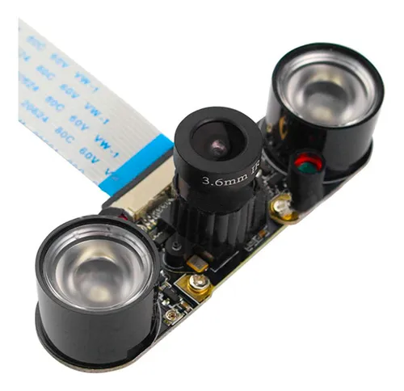

The solution was to switch to the standard Raspberry Pi camera. This change immediately resolved the issue, allowing the robot to function reliably in different environments. With this resolved, we proceeded to design and implement a custom mount for the camera, taking ideas from various designs for our solution.

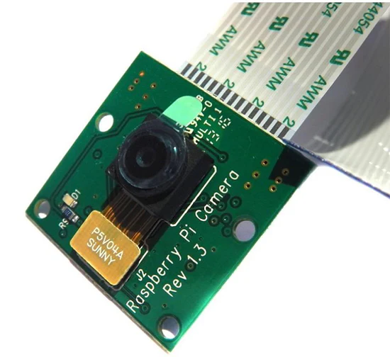
