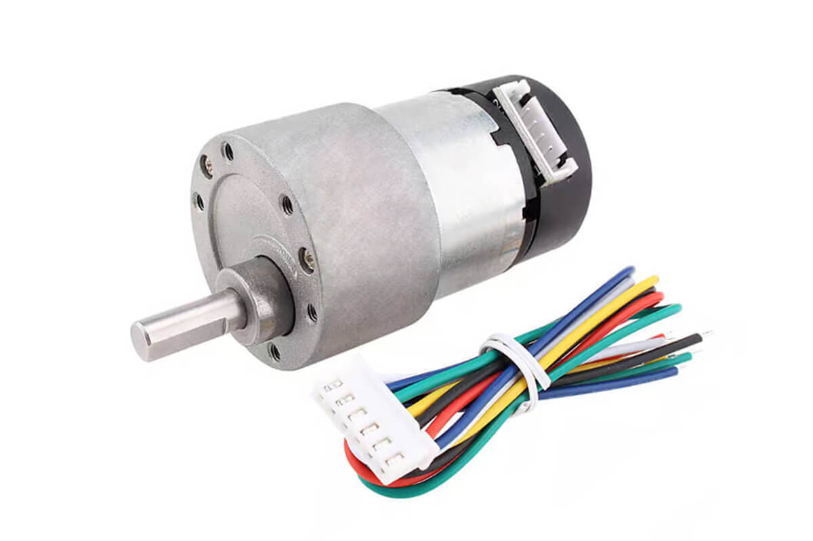

Diagramas Electricos
====

En esta seccion, se presentaran los diagramas electricos de todos los componentes electricos y una descripcion de su funcionamiento. Ademas se desglosara a grandes rasgos el hardware del robot y como se conecta con las piezas mecanicas del robot, todos los modelos y dise;os 3d mencionados en este aprtado se encuentran disponibles en la carpeta [models](/models).

Manejo de Movilidad
===
## Motor DC 12v con encoder 
Escogimos este motor principalmente por el encoder ya incluido en el, ya que con este sensor podemos conocer la posición del robot y ese dato nos aporta varios beneficios en nuestra solución: nos permite conocer cuantas vueltas ha dado, la distancia que se ha desplazado el robot, ayudarnos a estacionarnos en paralelo, en general todas las variables que estén relacionadas con la posición del robot. 

Inicialmente utilizábamos otro motor que ya tenía incluido un sistema diferencial, era parte de un juguete de un carro RC, con ese motor participamos en la etapa regional de Mexicali. Hicimos el cambio de motor ya que la velocidad del motor variaba mucho y no teníamos un encoder y sumadas esas 2 variables hacia muy difícil mantener la constancia del movimiento del robot. Sabemos que es imposible hacer que un robot repita de manera exacta una rutina en varios intentos, pero ese componente nos dificultaba aun mas esta tarea. Por eso realizamos el cambio a un motor con encoder y el diferencial de lego, ya que nos permite tener más control sobre diferentes variables y parámetros anteriormente mencionados. Para eso tuvimos que diseñar un soporte para el motor en el que también pudiera conectarse junto con el diferencial de lego nos tomó 3 revisiones. 

Imagen soporte rev1

Así se veía al inicio y nos permitía hacer pruebas sin embargo el motor no se fijaba de ninguna manera al soporte y eso generaba perturbaciones en nuestras pruebas. 

Imagen soporte rev3 

En la foto se puede ver la revisión actual del soporte en donde el motor ya se fija a este mismo y no genera las perturbaciones por el movimiento. Así mismo tuvimos un caso similar con el engrane que se conecta al motor. 

## Movimiento 
Para hacer que el robot se mueva derecho utilizamos un girosensor con un controlador PD, este nos permite hacer que el robot mantenga su posición al avanzar, como anteriormente hemos mencionado es imposible que el robot siempre se mantenga derecho, pero con este programa y sensor podemos hacer que el robot mantenga su posición por una buena cantidad de distancia y su desviación es muy pequeña , nunca superando los 2 cm del punto inicial. 
De igual manera utilizamos el Girosensor para las vueltas del robot, al momento de llegar al punto deseado el robot gira la dirección y el robot avanza hasta detectar el ángulo deseado, cuando llega al ángulo marcado detiene el motor y regresa la dirección a la posición original. 

Gestión de Potencia y los Sentidos
====

## Energía
El robot utiliza baterías de 3.7v a 9900mAh(18650), en total usa 6 baterías y están divididas en 3 portabaterias conectados en paralelo, esto ultimo para administra de manera eficiente la corriente del robot. El voltaje máximo del robot es de 8.4v.
Para entregarle la energía suficiente a nuestra computadora gráfica, el RaspBerry pi 4, utilizamos un regulador de voltaje regulado a 5.1v. Esto permite que la placa pueda funcionar correctamente sin la necesidad de conectarlo a un tomacorriente, cabe recalcar que al inicio nuestras pruebas para la gestión de obstáculos las realizábamos de esa manera, con el RaspBerry conectado a un tomacorriente al inicio esto nos permitió ver el comportamiento de nuestro código, pero a futuro era obvio que teníamos solucionar este problema ya que el robot no puede estar conectado a un tomacorriente durante las pruebas;).

## Sensores
Al inicio de la temporada nuestra propuesta fue utilizar los sensores laser VL53L0X, pensamos que serían la mejor opción por su largo alcance y precisión descrita, entonces nuestro primer chasis lo diseñamos teniendo en mente el uso de esos sensores. Conforme Realizamos pruebas notamos que por exactamente las características que seleccionamos esos sensores nos estaban afectando a nuestras pruebas y el algoritmo que propusimos, Los sensores no tienen un rango de visón recto, sino cónico y eso hacia que los sensores detectaran el suelo y las pruebas fallaban mucho. Por si no fuera poco, usar 3 de esos sensores consumían una cantidad intrigante de memoria de nuestro microcontrolador (Arduino UNO en ese momento).
Todos estos problemas nos condujeron a tomar la decisión de reemplazar los sensores laser por sensores ultrasónicos HC - SR04, con esos sensores participamos en la etapa regional y a día de hoy siguen siendo parte de nuestro modelo actual de robot, hacer el cambio fue sencillo ya que los soportes que utilizamos para los sensores ultrasónicos ya los habíamos diseñado para proyectos anteriores, e incorporarlos al chasis fue sencillo ya que siempre intentamos que los accesorios y sensores de nuestros proyectos sean modulares, ósea que sean fácil de reemplazar y el diseño del encastre para encajar el soporte de los sensores ultrasónicos en el chasis era el mismo que el de los sensores laser.

Esto hizo que la implementación y pruebas de los sensores fuera un cambio accesible y rápido.

 Anteriormente mencionamos que contamos con 3 sensores ultrasónicos, 1 al frente del robot y los otros 2 se encentran a los costados, los sensores de los contados son principalmente utilizados para encontrar la dirección de giro del robot, una vez el robot sale del primer cuadrante (en ambos desafíos) siempre habrá un lado donde halla barrera y un lado que no tenga barrera, el sensor que detecte la mayor distancia dictara el sentido del giro del robot, horario o antihorario. Mientras tanto el sensor ultrasónico dele frente tiene varias funciones, una de ellas es detectar la distancia entre el muro y el robot antes de dar vuelta en el desafío de vuelta libre, al detectar que está a 50 cm de la barrera el robot se detiene y procede a dar la vuelta. Otra de sus funciones es detectar la distancia entre el robot y un obstáculo en el desafío de obstáculos, cuando el robot se encuentra frente a menos de 15 cm de un obstáculo se detiene y gira en el sentido que el color indique. 

## HMI
En el 3er piso del vehiculo se encuentra un mini proto (170p) donde contamos con 3 leds y un boton; En el chasis tambien esta montado un mini protoboard con un buzzer pasivo. En el desafio de vuelta libre utilizamos 1 de los LEDs para que al momeneto de poresionar nuestro boton de arranque del codigo se encienda el LED y el buzzer ejecuta un sonido y asi saber que esta corriendo el codigo. En el desafio de obstaculos dependiendo del caso que la camara detecto, se encienden diferentes LEDs segun el caso con la finalidad de tener un apoyo visual y asi sabaer si la camara detecto el caso correcto; Ademas el buzer ejecuta sonidos diferentes degun el caso.
Cabe recalcar que el buzer genera un sonido al momento de detectar con los sensores ultrasonicos en todo momento.

Gestion de obtaculos
===
## Camara y su soporte
Para realizar el desafio de obtaculos optamos por utilizar la raspberry pi camera. En este apartado se encontrara unicamnete como montamos la camara sobre nuestro vehiculo y los modelos de camara que hemos utilizado durante la temporada, para mas la informacion acerca de nuestra propuesta de solucion para esquivar los obstaculos y nuestro algoritmo consulte la carpeta [src.](/src)

antes de usar la camara de raspberry, utilizabamos el modelo Night Vision Camera for Raspberry Pi - IR-CUT 5MP, y como su nombre lo indica es una camara de vion nocturna, al momento de probarla con la app OpenCV, la imagen era de con un filtro de color rojo y cuando cargabamos nuestro algoritmo de deteccion de colores no funcionaba. Al instante concluiamos que era por ese filtro, ya que en cualquier espacio donde probabamos nuestro codigo siempre mostraba valores diferentes y una de nuestras primeras soluciones fue aplicar un rango muy grande para cada color, verdy y rojo, esta solucion no funciono, ya que de igual manera no importaba en que espacio o salon nos encontrabamos siempre mostraba valores distintos, requeriamos de parametros muy especificos de luz y entorno y eso era un gran problema.

Paras solucionar este problema, tuvimos que cambiar de camara al modelo que comentamos anteriormente. Este cambio fue practicamente la solucion a nuestro problema ya que el robot ya podia funcionar en distintos entornos y parametros. Como ya teniamos resuelto este problema, ya podiamos comenzar a diseñar un soporte para la camara y ensamblarlo en el robot. este soporte due creado 100% por nosotros, tomamos algunas ideas de otros robot de como lo podiamos implementar. 

Cuando comenzamos a diseñarlo nos topamos con que la camara tenia que tener un cierto angulo de inclinacion para alcanazar a detectar los obstaculos dentro de cada cuadrante. Inicialmente propusimos un angulo de 45° hicimos el corte en MDF y nos percatamos en las pruebas que no era funcional debido a que el angulo de vision de la camara era muy pequeño y no podia detectar todos los obstaculos dentro de 1 cuadrante. Nuestar siguiente propuesta fue de 70° de inclinación y ese fue el grado correcto para que se alcanzaran a detectar los obstaculos de 1 cuadrante y ya con estas problematicas solucionadas, pudimos comenzar a trabajar en la resolucion de los diferentes casos para el desafio de obstaculos.
